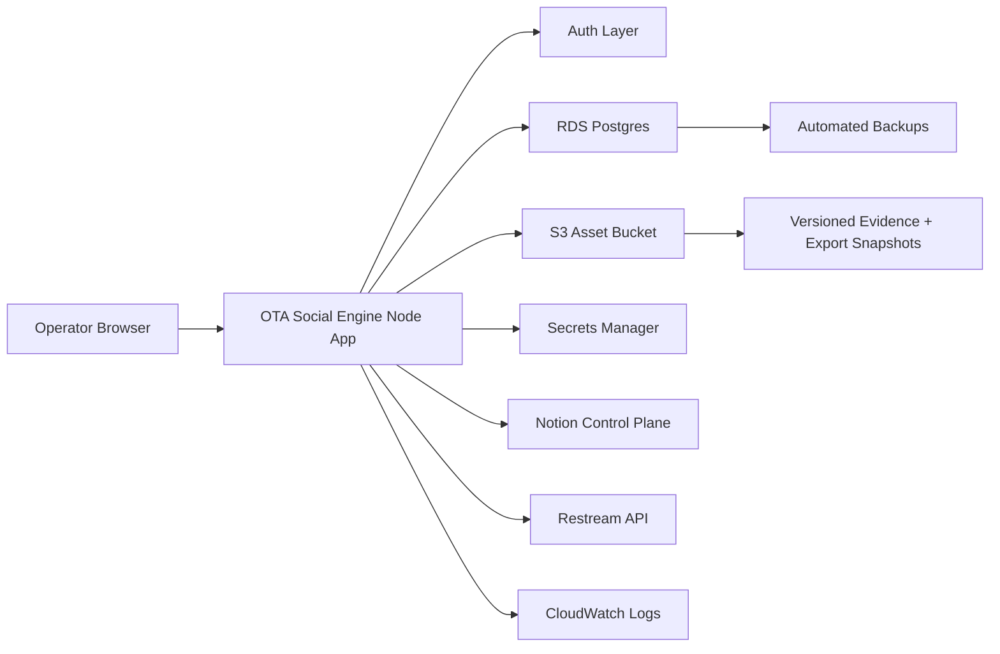

# OTA Social Engine Phase 9B Enterprise Hosting Architecture

## Status

Phase 9B is an architecture decision phase. It is not a deployment phase.

No external deploy should happen until Phase 9A blockers are reviewed and the user explicitly authorizes a deployment target.

## Blindspot Question

Based on what our goal is, what blindspots are we not seeing to achieve the ultimate goal?

For Phase 9B, the blindspot is assuming that "hosted" means "official." OTA Social Engine needs a hosting architecture that protects brand identity, assets, evidence, credentials, approvals, audit history, cross-brand boundaries, and future healthcare-adjacent CRS governance.

## Architecture Recommendation

Use an enterprise-lite AWS architecture:

| Layer | Phase 9B Recommendation | Why |
| --- | --- | --- |
| App/API hosting | AWS App Runner or ECS Fargate | The app requires a Node backend. Static-only hosting is not enough. |
| Primary data | Postgres on Amazon RDS, preferably Multi-AZ for production | Workflow state, approvals, audit records, and sync state need transactional storage. |
| Human control plane | Notion remains the operator-readable control plane | Notion is strong for review, status, and structured operations, but should not be the only production transaction log. |
| Assets | Amazon S3 with versioning, encryption, and lifecycle rules | Profile images, banners, proof files, screenshots, GIFs, and videos need durable object storage. |
| Secrets | AWS Secrets Manager or SSM Parameter Store | Restream credentials and OAuth material must not depend on local encrypted files in production. |
| Auth | AWS Cognito, SSO, or private admin-token gate for first hosted MVP | Phase 8 roles need real identities behind them. |
| Audit | Postgres audit table plus S3 export snapshots | Audit events should be queryable and exportable. |
| Logs/alerts | CloudWatch logs and alarms | Production issues need visibility. |
| Backups | RDS automated backups plus S3 versioning/export | Recovery must be part of the platform, not an afterthought. |

## Important Decision

Do not use S3 as the primary database.

S3 is the right place for files, exports, backups, and immutable snapshots. It is not the right primary transactional store for profile workflow state, approval transitions, permissions, or connector state.

## Target Deployment Shape

## Phase 9B Pass/Warn/Block

| Area | Status | Reason |
| --- | --- | --- |
| Node-capable hosting target | Pass | App Runner or ECS Fargate can run the backend. |
| S3 asset strategy | Pass | S3 fits controlled source assets, evidence files, and snapshots. |
| S3 as database | Block | Do not use object storage as the transactional workflow database. |
| RDS/Postgres primary state | Pass | Best fit for transactional state and audit. |
| Notion as sole production database | Warn | Good control plane, weak as sole transactional system for governed connector operations. |
| Local JSON production state | Block | Not durable or multi-operator safe. |
| Local encrypted secret files | Block | Replace with managed secret store before official hosted production. |
| Phase 8 simulated roles | Block | Replace or wrap with real auth identity before official hosted production. |
| Direct Restream submit | Warn | Keep gated until auth, audit, approvals, and YouTube platform status are confirmed. |

## Deployment Sequence

1. Create production environment inventory.
2. Choose App Runner or ECS Fargate.
3. Add Postgres schema for brands, profiles, assets, evidence, Restream candidates, roles, and audit events.
4. Add S3 asset adapter.
5. Add AWS Secrets Manager adapter.
6. Add auth gate.
7. Add Notion live-sync adapter.
8. Add migration/export from local JSON into Postgres/Notion.
9. Run OTAP profile through full staging workflow.
10. Deploy only after explicit user authorization.

## Phase 9B Exit Criteria

Phase 9B is complete when the team has selected the target hosted architecture and identified every production blocker that must be cleared before Phase 9C implementation.

